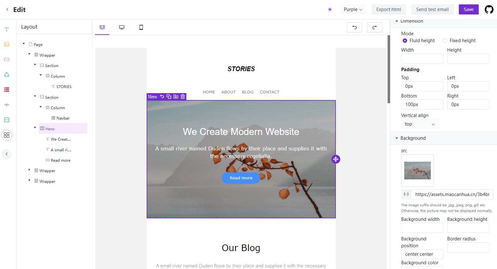

# Realmail

<p align="center">

  <br/>
  <a aria-label="Vercel logo" href="https://vercel.com">
    
  </a>
  <br/>

  
  <a aria-label="NPM version" href="https://www.npmjs.com/package/realmail-editor">
    
  </a>
  <a aria-label="React version" href="https://react.js">
    
  </a>
  <a aria-label="MJML" href="https://mjml.io/">
    
  </a>
  <a aria-label="Package size" href="https://www.typescriptlang.org/">
    
  </a>
  
</p>

## Introduction

Realmail is developed based on the [MJML](https://mjml.io/) and has very good compatibility. At the same time, it can generate code through drag-and-drop editing. This project is forked from [Easy email](https://github.com/arco-design/easy-email).

## Features:

- Drag and drop editor
- Can be converted into `MJML`, or generated through `MJML`
- Defined custom block
- Dynamic rendering
- Easily customize UI when you need
- Theme configuration

|                                                   Video Overview                                                    |
| :-----------------------------------------------------------------------------------------------------------------: |
| <a href="https://www.bilibili.com/video/BV1YQ4y167bb" target="_blank"></a> |
|                          Watch video overview:https://www.bilibili.com/video/BV1YQ4y167bb                           |

## Live Demo

Check out the live demo here: <a href="http://www.realmail.club" target="_blank" alt="http://www.realmail.club">http://www.realmail.club</a>

## Getting started

```sh
$ npm install --save realmail-core realmail-editor realmail-extensions react-final-form
```

or

```sh
$ yarn add realmail-core realmail-editor realmail-extensions react-final-form
```

```js
import React from 'react';
import { BlockManager, BasicType } from 'realmail-core';
import { EmailEditor, EmailEditorProvider } from 'realmail-editor';
import { SimpleLayout } from 'realmail-extensions';

import 'realmail-editor/lib/style.css';
import 'realmail-extensions/lib/style.css';
import '@arco-themes/react-easy-email-theme/css/arco.css'; // theme, If you need to change the theme, you can make a duplicate in https://arco.design/themes/design/1799/setting/base/Color

const initialValues = {
  subject: 'Welcome to realmail',
  subTitle: 'Nice to meet you!',
  content: BlockManager.getBlockByType(BasicType.PAGE)!.create({}),
};

function App() {
  return (
    <EmailEditorProvider
      data={initialValues}
      height={'calc(100vh - 72px)'}
      autoComplete
      dashed={false}
    >
      {({ values }) => {
        return (
          <SimpleLayout>
            <EmailEditor />
          </SimpleLayout>
        );
      }}
    </EmailEditorProvider>
  );
}

export default App;

```

</br>

## Configuration

| property           | Type                                                                                               | Description                                                                                                                          |
| ------------------ | -------------------------------------------------------------------------------------------------- | ------------------------------------------------------------------------------------------------------------------------------------ |
| height             | string / number                                                                                    | Set the height of the container                                                                                                      |
| data               | interface IEmailTemplate { content: IPage; subject: string; subTitle: string; }                    | Source data                                                                                                                          |
| children           | ( props: FormState<T>,helper: FormApi<IEmailTemplate, Partial<IEmailTemplate>>) => React.ReactNode | ReactNode                                                                                                                            |
| onSubmit           | Config<IEmailTemplate, Partial<IEmailTemplate>>['onSubmit'];                                       | Called when the commit is triggered manually                                                                                         |
| fontList           | { value: string; label: string; }[];                                                               | Default font list.                                                                                                                   |
| interactiveStyle   | { hoverColor?: string; selectedColor?: string;}                                                    | Interactive prompt color                                                                                                             |
| onUploadImage      | (data: Blob) => Promise<string>;                                                                   | Triggered when an image is pasted or uploaded                                                                                        |
| onAddCollection    | (payload: CollectedBlock) => void;                                                                 | Add to collection list                                                                                                               |
| onRemoveCollection | (payload: { id: string; }) => void;                                                                | Remove from collection list                                                                                                          |
| dashed             | boolean                                                                                            | Show dashed                                                                                                                          |
| autoComplete       | boolean                                                                                            | Automatically complete missing blocks. For example, Text => Section, will generate Text=>Column=>Section                             |
| mergeTags          | Object                                                                                             | A merge tag is a bit of specific code that allows you to insert dynamic data into emails. Like `{{user.name}}`, and used for preview |
| previewInjectData  | Object                                                                                             | Dynamic data for preview, it will overwrite mergeTags.                                                                               |
| onBeforePreview    | (html: string, mergeTags: PropsProviderProps['mergeTags']) => string                               | Promise<string> You can replace mergeTags when previewing.                                                                           |

## Hotkeys

| hotkey            | Description                                                                                       |
| ----------------- | ------------------------------------------------------------------------------------------------- |
| mod+z             | undo                                                                                              |
| mod+y             | redo                                                                                              |
| delete/backspace  | delete block                                                                                      |
| tab / shift + tab | fast select block, if block is focusing,`tab` select next block & `shift + tab` select prev block |

## Packages

- [realmail-core](./packages/realmail-core/readme.md)
- [realmail-editor](./packages/realmail-editor/readme.md)
- [realmail-extensions](./packages/realmail-extensions/readme.md)

</br>

## How does it work?


</br>

## License

The MIT License
